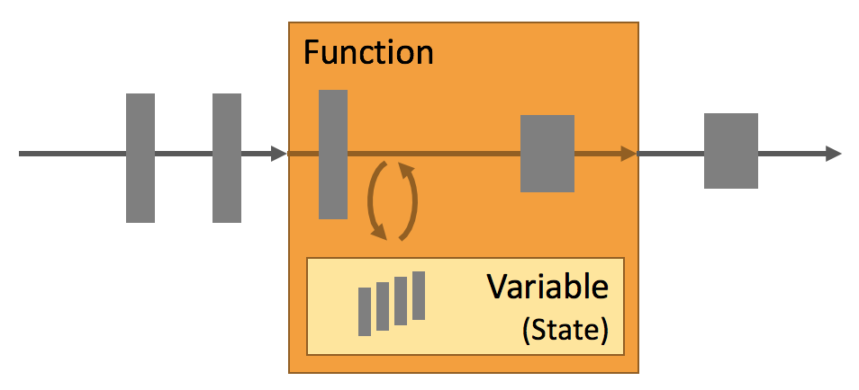

# Applications
- 다양한 추상화 수준에서 여러 API 제공
- 일반적 use case를 위한 전용 library 제공

## Streaming Application을 위한 Building Blocks(?)
- Stream process framework로 build 및 실행할 수 있는 유형의 application은 framework가 얼마나 stream, state, time을 잘 제어하는가에 의해 정의된다.

### Streams
- stream은 stream procssing의 근본적인 측면이다.
- 하지만, stream은 `서로 다르게 처리되어야 하는 특징`들이 있다.
    - Bounded / Unbounded: Flink는 unbounded stream을 처리하는 정밀한 기능뿐 아니라 효율적으로 bounded streams을 처리할 수있는 특정 operator도 갖는다.
    - Real-time / Recorded: `모든 데이터는 stream으로 생성`되며, 생성되는 즉시 Real-time으로 처리하거나, storage에 넣어 추후 처리하는 방법이 있다.

### State
- 모든 non-trivial`(자명하지 않은(?))` streaming application은 stateful하다. 
- 개별 이벤트에 transformations을 적용하는 Application만 stateless하다.
- basic business logic을 실행하는 모든 application은 이벤트 또는, 중간 결과를 기억하여 나중에(다음 이벤트 수신, 특정 기간 후 등) 엑세스해야 한다.

- Application state는 flink에서 1급 시민이다.(Flink의 아래 기능을 통해 알 수 있다.)
    - Multiple State Primitives: atomic value, list, map 등 `다양한 자료구조에 대한 state primitives를 제공`한다.
    - Pluggable State Backends
        - Application state는 Pluggable state backend에서 관리되거나 checkpoint 된다.
        - `state를 Memory나 RocksDB에 저장`하는 differente state backend를 특징으로 함
        - Custom state backend 또한 plug될 수 있다.
    - Exactly-once state consistency: checkpoint와 recovery 알고리즘으로 fail 시에도 application state를 일관되게 하고, `fail도 투명하게 처리되어 Application의 정확성에 영향을 미치지 않는다.`
    - Very Large State: TB 단위의 application state 유지 가능(asynchronous, incremental checkpoint algorithm 덕분)
    - Scalable Applications: state를 더 많거나 적은 worker에 재분배하여 `stateful application의 확장을 도움`

### Time
- `streaming processing에서 어떻게 application이 time을 측정하는지가 중요`하다.(difference of event-time / processing-time 등)
    - event가 대부분 특정 시점에 생성되기 때문에
    - 일반적인 stream computation(windows aggregation, sessionization, pattern detected, time-based join 등)이
 time based이기 때문에
- Flink가 제공하는 Time 관련 기능
    - Event-time Mode
        - event-time semantic을 통해 stream을 처리하는 application은 event의 timestamp에 기초하여 결과 계산
        - 이를 통해 recorded / real-time에 관계없이 정확, 일관된 결과를 얻을 수 있다.
    - Watermark Support: watermark를 통해 시간 파악. 이는 `결과의 latency와 완전성을 상쇄할 수 있는 메커니즘`이다.
    - Late Data Handling
        - watermark를 사용하여 event-time mode에서 stream을 처리할 때, `모든 관련한 event의 도착 전에 계산이 완료될 수 있다.`
        - 이러한 event를 `late event`라고 부르며, sideoutput이나 과거 완료된 결과 update 등 `late event처리가 가능한 옵션 제공`
    - Processing-time Mode
        - `실제 코드를 실행하는 데 걸린 시간에 의해 시작되는 계산을 수행`하기 위한 `processing-time semantics도 제공`
        - 이는 low-latency가 엄격하게 요구되는 Application에 적합

## 계층 API
- 3계층 API 제공.
- 각 API는 간결성, 표현성 사이에서 서로 다른 절충안을 제공하며 다양한 use case를 대상으로 함


### ProcessFunctions
- Flink가 제공하는 가장 비싼 function interface
- window에서 하나 또는 두개의 input stream으로부터의 개별 event 또는 그룹화된 event를 처리하는 기능
- Time / State에 대한 세부적 control 제공
- state를 임의로 수정 및 나중에 Callback 함수를 trigger할 timer를 등록할 수 있다.
- 많은 stateful event-driven application에 필요한 `복잡한 event별 business logic을 구현할 수 있다.`
> START and END event Example(표현력 강조)
```java
//START, END event의 timestamp의 차이를 계산한다.
// 첫번째 String field는 key, 두번째 String은 START, END event를 표시
public static class StartEndDuration extends KeyedProcessFunction<String, Tuple2<String, String>, Tuple2<String, Long>> {
    private ValueState<Long> startTime;

    @Override
    public void open(Configuration conf){
        stateTime = getRuntimeContext().getState(new ValueStateDescriptor<Long>("startTime", Long.class));
    }

    //처리된 각 event를 위해 호출됨
    @Override
    public void processElement(Tuple2<String, String> in, Context ctx, Collector<Tuple2<String, Long> out>)     throws Exception{
        switch (in.f1) {
            case "START":
                // start event 수신시 start time set
                startTime.update(ctx.timestamp());
                // start event로부터 4시간 타이머 등록
                ctx.timerService()
                .registerEventTimeTimer(ctx.timestamp() + 4 * 60 * 60 * 1000);
                break;
            case "END":
                // end event 수신시 end - start 시간을 내보냄
                Long sTime = startTime.value();
                if (sTime != null) {
                out.collect(Tuple2.of(in.f0, ctx.timestamp() - sTime));
                // state 초기화
                startTime.clear();
                }
            default:
                // do nothing
        }
    }
    // timer 만료시 호출
    @Override
    public void onTimer(
        long timestamp,
        OnTimerContext ctx,
        Collector<Tuple2<String, Long>> out) {

        // timeout이므로 state를 비운다.
        startTime.clear();
    }
}
```

### DataStream API
- Windowing, record-at-a-time transformation, 외부 data store로의 풍부한 query 등 일반적 stream 처리를 위한 기본요소 제공
- Java / Scala에서 사용 가능하며 map, reduce, aggregate 등의 함수에 기초한다.
- Java / Scala의 lambda 함수 또는 interface 확장으로 정의될 수 있다.
> click stream 세션화 및 세션당 클릭 수 계산 예제
```java
// website click stream
DataStream<Click> clicks = ...

DataStream<Tuple2<String, Long>> result = clicks
  // userId 클릭 시 카운트 1 증가 project
  .map(
    // MapFunction을 구현한 함수 정의
    new MapFunction<Click, Tuple2<String, Long>>() {
      @Override
      public Tuple2<String, Long> map(Click click) {
        return Tuple2.of(click.userId, 1L);
      }
    })
  // userId에 의한 Key(field 0)
  .keyBy(0)
  // 30분을 갭으로 한 session window 정의
  .window(EventTimeSessionWindows.withGap(Time.minutes(30L)))
  // 세션당 clicks count(람다로 정의)
  .reduce((a, b) -> Tuple2.of(a.f0, a.f1 + b.f1));
```
### SQL & Table API
- 두 API 모두 batch 및 stream 처리를 위한 것
- query는 `unbounded real-time stream`에서도, `bounded recorded stream`에서도 같은 결과를 제공
- 파싱, 검증, query 최적화를 위해 Apache Calcite 사용
-  `원활하게 DataStream, DataSet API와 통합`될 수 있고, User defined scalar, aggregate 및 테이블을 반환하는 함수 지원
- 데이터 분석, 파이프라이닝, ETL application의 정의를 쉽게 하도록 설계됨
>clickstream 세션화 및 session 당 click 수를 세는 Query. DataStream API의 예시와 동일
```SQL
SELECT userId, COUNT(*)
FROM clicks
GROUP BY SESSION(clicktime, INTERVAL '30' MINUTE), userId
```

## Libraries
- 일반적 데이터 처리를 예제를 위한 libraries
- 일반적으로 API에 내장되어 있으며 완전히 자체적이진 않아, 다른 library와 통합될 수 있는 이점이 있다.

### Complex Event Processing(CEP)
- Pattern detection
- event의 특정한 Pattern을 지정하는 API 제공(Regex / state machine)
- DataStream API와 통합되어 DataStream에서 pattern 평가
- 네트워크 침입 탐지, business process monitoring 및 부정 행위 탐지 등 포함

### DataSet API
- batch processing application을 위한 Flink core API
- map, reduce, join, co-group, iterate 등이 DataSet API 기본 요소
- 모든 operation이 알고리즘, 자료구조에 의해 지원 -> 이 알고리즘은 memory의 직렬화된 데이터에 대해 작동, 데이터 크기가 메모리 초과시 Disk로 이동
- hybrid hash-join이나 external merge-sort를 베이스로 한 알고리즘

### Gelly
- 확장 가능한 그래프 처리, 분석을 위한 라이브러리
- DataSet API 기반 구현 및 통합됨`(확장 가능하고 강력한 Operator)`
- label propagation, triangle enumeration, page rank 등이 특징이지만, custom graph algorithm의 구현을 용이하게 하는 API도 제공한다.