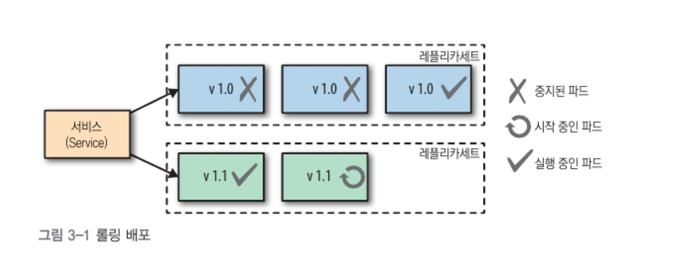
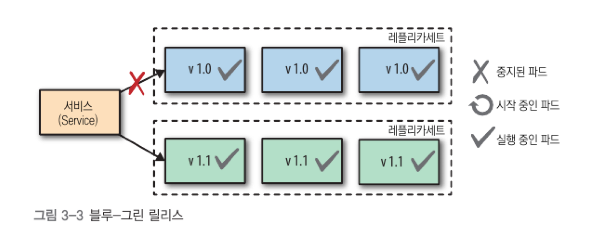
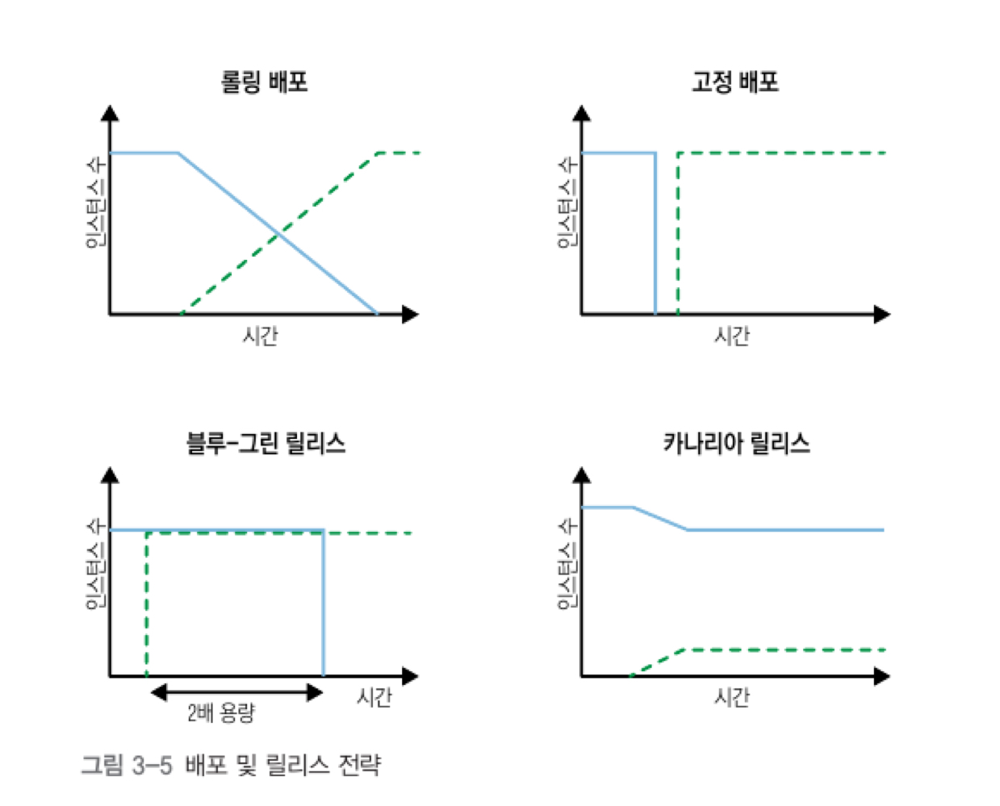

# Declarative Deployment
- 핵심은 k8s resource 중 deployment
  - Container Group의 Upgrade, Rollback process를 캡슐화
  - Container Group을 반복적, 자동화된 동작으로 실행할 수 있다.

## 문제
- MicroService의 수가 증가하면 버전 업에 대한 부담이 커진다.
  1. 새 버전의 Pod 시작
  1. 이전 버전 Pod 종료
  1. 성공적으로 시작되었는지 대기 및 확인
  1. 실패했을 경우 Rollback
- 위 동작을 위해 아래 두 가지 경우의 release process가 존재할 수 있다.
  - Down time은 허용하지만, 동시에 여러 버전의 service를 실행하지 않는 경우(V1,V2 이렇게 API를 나누어 실행하지 않는 경우 등)
  - Down time은 없지만 업데이트가 진행되는 동안 두 버전의 서비스가 함께 실행되어 자원 사용이 증가하는 경우
- 수동으로 하다보면 Human Error가 발생할 수 있고, script를 만들어야 할 수도 있으므로 Bottleneck

## 해결책
- Kubernetes는 Deployment를 통해 문제 상황에 대한 process를 자동화했다.
- Deployment를 사용하여 아래 내용들을 기술할 수 있다.
  - Application 업데이트 방법
  - 개별 전략 활용
  - 다양한 업데이트 프로세스 조정
- Deployment의 핵심은 `예측 범위 안에서 Pod Set를 시작, 중지하는 기능`
  - Container가 lifecycle event(ex. sigterm) 등을 잘 수신해야 한다.
  - Pod가 성공적으로 실행되었는지를 알려주는 정상상태 확인 endpoint를 제공해야 한다.
- Container가 위 두 가지를 정확히 커버한다면
  - Platform은 이전 `Container를 깨끗하게 종료`할 수 있다.
  - 업데이트된 instance를 시작해서 `이전 instance를 교체`할 수 있다.
  - 이후 update process의 `나머지 부분을 선언적인 방법으로 정의`해서, 미리 정의된 단계와 예상 결과를 하나의 `atomic한 작업으로 실행`할 수 있다.

### Imperative Rolling Update(기존 Rolling Update, Deprecated)
- kubectl을 통해 처음부터 Rolling Update를 지원했었으나, 이것은 `선언형이 아닌, 명령형`이었다.
  - kubectl client가 각 Update 단계에 대한 수행 작업을 서버에 알려준다.
- 가장 큰 문제는 배포 내용을 확인하는 유일한 방법이 `시스템 상태를 체크하는 것`

### 롤링 배포
- 선언적으로 Application을 update하는 방법이 Deployment를 활용하는 것.
- 내부적으로 set 기반 LabelSelector를 지원하는 ReplicaSet 생성
- RollingUpdate, Recreate와 같은 전략을 사용하여 `Update Process 동작을 구체화할 수 있다.`
- 새로운 ReplicaSet을 생성하여 이전 것을 교체하는 로직으로 구현되어 있다.
- maxSurge, maxUnavailable을 통해 초과 Pod, 사용 가능한 Pod 범위 제어 가능
- `Update Process 동안 중단이 없음을 보장`
```yaml
# 예제
apiVersion: apps/v1
kind: Deployment
metadata:
  name: random-generator
spec:
  replicas: 3 # RollingUpdate를 위해서는 2개 이상의 Replica가 필요
  strategy:
    type: RollingUpdate
    rollingUpdate:
      maxSurge: 1 # Update 동안에 일시적으로 지정된 Replica 수에 추가로 실행될 수 있는 Pod의 수
      maxUnavailable: 1 # Update 동안에 사용 불가능하게 될 수 있는 Pod 수(예제에서 최소 2개의 Pod는 항상 사용 가능해야 한다.)
    selector:
      matchLabels:
        app: random-generator
    teplate:
      metadata:
        labels:
          app: random-generator
  spec:
    containers:
    - image: k8spatterns/random-generator:1.0
      name: random-generator
      readinessProbe: # zero downtime을 제공하기 위해 매우 중요한 Probe
        exec:
          command: [ "stat", "/random-generator-ready" ]   
```


#### 장점
- kubernetes resource이므로 `전체 Update process가 client와 상호작용 없이 server 측에서 실행된다.`
- 선언적인 특성을 통해 배포에 필요한 단계보다, 배포된 상태가 어떻게 보여야 하는지를 알 수 있다.
- 운영 환경에 배포되기 전에 다양한 환경에서 테스트된 실행이 가능한 객체이다.
- Update Process는 모두 기록되며, pause 및 continue, rollback을 위한 옵션으로 버전이 지정됨

### 고정 배포
- RollingUpdate는 무중단 배포를 위해 유용하지만, `Update process 동안에 두 버전의 Container가 동시에 실행된다.`
- 이를 위해 `Recreate 전략` 사용
#### Recreate
- maxUnavailable 개수를 `replica와 똑같은 개수로 설정하는 효과가 있다.`
  - 현재 버전 container를 모두 죽이고, 이전 버전의 container가 축출될 때 `모든 신규 Conatiner를 동시에 시작`
  - Down time이 발생하지만, 두 버전의 컨테이너가 동시에 실행되지 않으며, 서비스 컨슈머가 `하나의 버전만 처리 가능하도록 단순화`


### Blue-Green Deployment
- Green: `어떤 요청도 처리하지 않은 최신 버전의 Container`
- Blue: 이전 Pod Replica
- `Down time을 최소화`하고, `위험성을 줄여서 운영 환경에 소프트웨어를 배포하기 위해 사용`되는 Release Strategy
- `Service Mesh` 또는 `Knative`와 같은 extended service를 사용하지 않으면, `수동으로 수행되어야 한다.`
#### 동작과정
1. Green으로 두 번째 Deployment를 생성하여 실행
1. 이 때, Blue가 여전히 실행되며 실제 요청을 처리
1. Green이 정상이며 Ready 상태가 되었다면, 트래픽을 Blue -> Green으로 전환(Service Selector를 Green으로 일치시키는 업데이트에 의해 수행)
1. Green이 모든 traffic을 처리하면, Blue는 삭제될 수 있고, 또 다른 Blue-Green deployment를 위해 Blue가 해제됨


#### 장점
- 요청을 처리하는 Application 버전이 하나뿐이어서, 여러 버전이 처리되는 복잡성을 줄여줌
#### 단점
- 자원이 2배로 필요
- 전환하는 동안 long-running process 및 데이터베이스 상태 변화로 인해 심각한 문제가 발생할 수 있다.

### Canary Release(카나리아 릴리즈)
- 이전 instance의 `작은 하위집합만 새로운 instance로 교체함`으로써 새 버전의 Application을 운영 환경에 유연하게 배포하는 방식
- 시험 대상의 반응이 만족스러울 경우에만 나머지도 교체
#### 동작과정
1. Canary instance로 쓰이는 작은 replica 수를 갖는 신규 버전의 컨테이너에 대해 새로운 ReplicaSet을 생성하여 구성
1. Service는 Consumer 중 일부를 Update된 Pod instance로 바로 연결해야 함
1. 모든게 정상 작동하면 신규 ReplicaSet을 늘리고, 기존 것을 0개로 줄인다.


#### 장점
- `일부 Consumer만 Update된 버전을 사용하게 함`으로써 운영 환경에 `새 버전을 도입할 때 위험을 줄여줌`

## 정리
- 배포 전략(Rolling, Recreate)는 기존 Container를 새로운 Container로 교체하는 것을 제어
- 릴리즈 전략(Blue-Green, Canary)는 서비스 컨슈머에게 새로운 버전이 제공되는 방식 제어
  - 완전 자동화는 불가능

